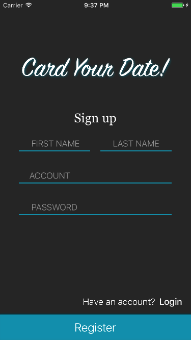
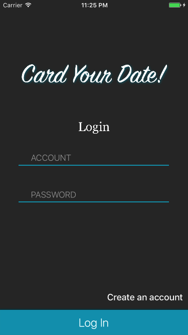
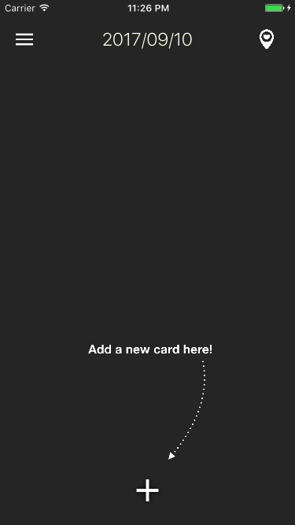
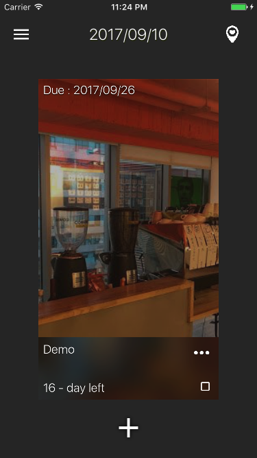
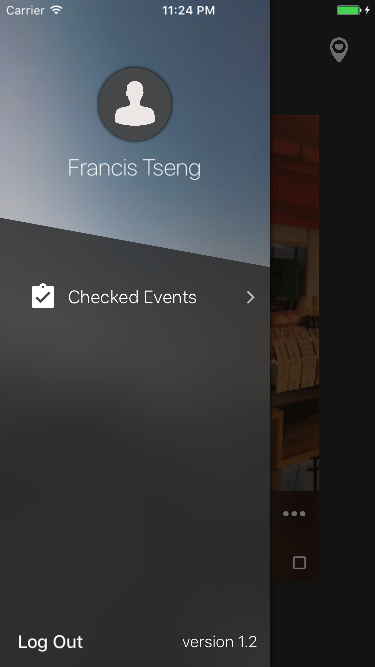

# Card Your Date!

***
* 下載此專案後，須申請 `Google Places 的 Key` 以及 `Firebase 的 .plist`方可順利執行。

##簡介
**Card Your Date!** 是一款用卡片形式紀錄事件且有倒數功能的 iOS App，並每天提醒最近到期的事件。可以從[此處](https://itunes.apple.com/us/app/card-your-date/id1273603261)免費下載。

* 串接 Google Places API 取得地點資訊
* 使用 UserNotification 固定時間通知
* 使用 Firebase 作為後端服務平台，可跨 iOS 裝置使用
* 透過 NSDate 處理日期
* 使用 Swiftlint 管理程式碼習慣
* 導入 Analytics 及 Crashlytics

##截圖

* **登入 & 註冊畫面**

* **主畫面**  
沒有事件時  
有事件時

* **新增事件**  

* **修改事件**

* **側拉選單**

* **已完成清單**  
若事件已完成可從主畫面移至此清單

* **地點清單**  
可搜尋地點得到地址、圖片，並可把圖片設成卡片背景圖片

##使用套件
* Firebase
* AnimatedCollectionViewLayout
* JTAppleCalendar
* IQKeyboardManagerSwift
* NVActivityIndicatorView
* SkyFloatingLabelTextField
* GooglePlaces
* SwifterSwift
* SDWebImage/WebP
* SlideMenuControllerSwift
* Fabric
* Crashlytics

